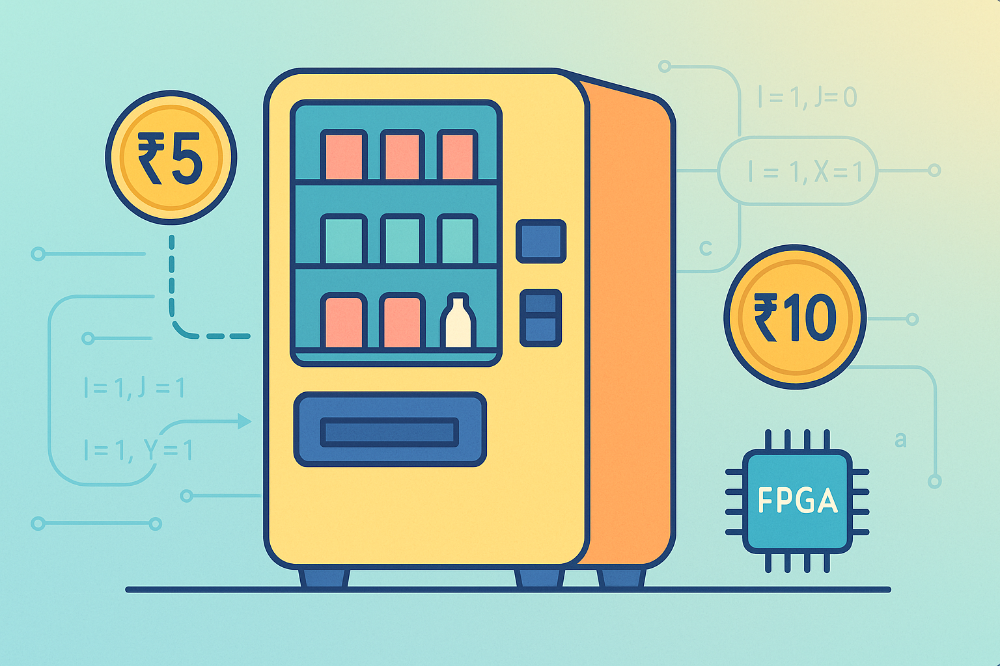

# 🥤 Vending Machine FSM (Mealy Model)

> **A Verilog implementation of a Mealy state machine** that dispenses a product worth **Rs. 15**, accepts only **Rs. 5** and **Rs. 10** coins, and even gives change if you overpay.  
> Built with ❤️ for **FPGA / Digital Design learners**.

---

<p align="center">
  
</p>


---

## 1️⃣ Problem Understanding

We’re designing a **Mealy model vending machine** that:

- Accepts only **Rs. 5** and **Rs. 10** coins  
- Product price: **Rs. 15**  
- If Rs. 20 is inserted → delivers product + returns Rs. 5  
- **Inputs:**
  - `I` — Coin insertion signal (1 = coin inserted, else 0)
  - `J` — Coin type (0 for Rs. 5, 1 for Rs. 10)
- **Outputs:**
  - `X` — Product delivery signal
  - `Y` — Rs. 5 return signal

---

## 2️⃣ State Machine Analysis

### State Definitions

| State | Name            | Meaning        |
|-------|-----------------|----------------|
| a     | `S_IDLE`        | Rs. 0 received |
| b     | `S_5_RUPEES`    | Rs. 5 received |
| c     | `S_10_RUPEES`   | Rs. 10 received |

---

### State Encoding

We will use **binary encoding** (2 bits):

| State         | Encoding |
|---------------|----------|
| S_IDLE        | `2'b00`  |
| S_5_RUPEES    | `2'b01`  |
| S_10_RUPEES   | `2'b10`  |

---

### State Diagram 

```mermaid
stateDiagram-v2
    [*] --> S_IDLE

    S_IDLE --> S_5_RUPEES: I=1, J=0 (Rs. 5)
    S_IDLE --> S_10_RUPEES: I=1, J=1 (Rs. 10)
    S_IDLE --> S_IDLE: I=0

    S_5_RUPEES --> S_10_RUPEES: I=1, J=0 (Rs. 5)
    S_5_RUPEES --> S_IDLE: I=1, J=1 / X=1, Y=0
    S_5_RUPEES --> S_5_RUPEES: I=0

    S_10_RUPEES --> S_IDLE: I=1, J=0 / X=1, Y=0
    S_10_RUPEES --> S_IDLE: I=1, J=1 / X=1, Y=1
    S_10_RUPEES --> S_10_RUPEES: I=0
````

---

## 3️⃣ State Transitions

#### **S\_IDLE**

* `I=0` → Stay in `S_IDLE`
* `I=1 & J=0` → Go to `S_5_RUPEES`, X=0, Y=0
* `I=1 & J=1` → Go to `S_10_RUPEES`, X=0, Y=0

#### **S\_5\_RUPEES**

* `I=0` → Stay in `S_5_RUPEES`
* `I=1 & J=0` → Go to `S_10_RUPEES`, X=0, Y=0
* `I=1 & J=1` → Deliver product (X=1, Y=0), go to `S_IDLE`

#### **S\_10\_RUPEES**

* `I=0` → Stay in `S_10_RUPEES`
* `I=1 & J=0` → Deliver product (X=1, Y=0), go to `S_IDLE`
* `I=1 & J=1` → Deliver product + return Rs. 5 (X=1, Y=1), go to `S_IDLE`

---

## 🖥 Simulation Commands

```bash
# Compile
iverilog -o vending_machine_tb vending_machine.v vending_machine_tb.v

# Run Simulation
vvp vending_machine_tb

# View Waveform
gtkwave vending_machine_tb.vcd
```

---

## 🚀 Future Improvements

1. 💲 **Configurable Pricing** – Change price without modifying HDL
2. 💰 **More Coin Types** – Rs. 2, Rs. 20, and digital payments
3. 🔄 **General Change Return** – Return any change amount
4. 🛒 **Multi-Product Support** – Different prices per product
5. ⚠ **Error Handling** – Detect jams, invalid coins, double insertions
6. 🔋 **Low Power Mode** – Clock gating in idle state
7. 🛠 **Parameterization** – Easily scalable FSM
8. ✅ **Glitch-Free Outputs** – Registered outputs to avoid hazards
9. 🔍 **BIST Mode** – Built-in self-test for maintenance
10. 🔐 **Security** – Lock system, tamper detection, event logging

---

## 📊 Impact

> This design moves beyond a classroom demo to a **scalable, configurable, and production-ready vending machine controller** — adaptable for multiple products, dynamic pricing, robust error handling, and power efficiency.

---

## 📂 Repository Structure

```
📁 vending_machine_fsm
 ├── vending_machine.v                       # Main FSM Verilog module
 ├── vending_machine_tb.v                    # Testbench
 ├── Wave form                               # Simulation Waveform File
 ├── Circuit.png                             # Circuit diagram of the vending machine
 ├── State_Table.png                         # State transition table
 ├── ASM_Chart.png                           # Algorithmic State Machine chart
 ├── Design_Equations.png                    # Boolean equations for design
 ├── README.md                               # This file 😄
```

---

## 🏆 Key Learning Points

* Designing **Mealy FSMs** in Verilog
* Binary state encoding & state transitions
* Handling synchronous and asynchronous signals
* Creating clean testbenches for digital systems

---

💡 **Pro Tip:**
Want to make it industry-ready?<br>
✅ Parameterize everything<br>
✅ Keep outputs glitch-free<br>
✅ Add fault detection logic<br>

```
